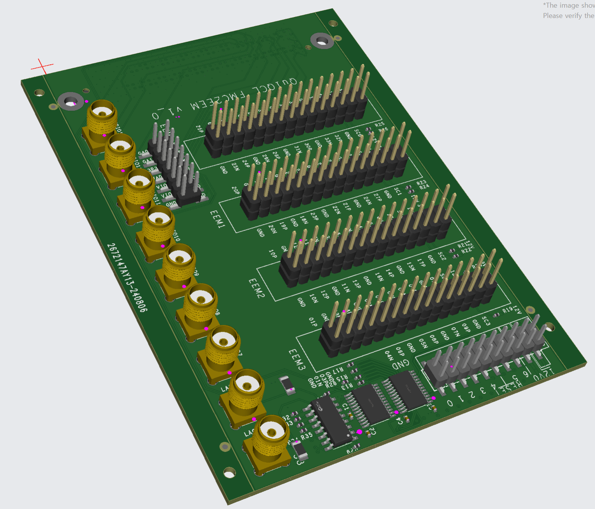
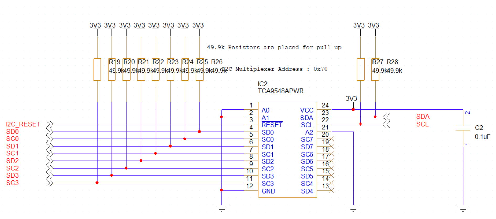
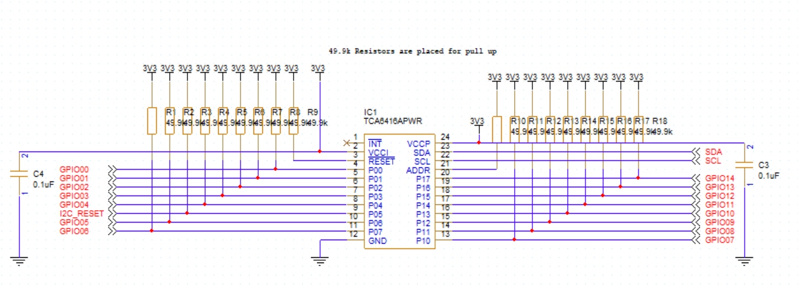

# FMC2EEM
## Overview
<p align="center">

</p>

This PCB borad converts FMC connector interface to EEM(Eurocard Extension Module) connector interface which is standard interface of ARTIQ PCB designs. This board can be used as daughter board with VITA57.1 and VITA57.4 FMC connectors. Gigabit transciever pins are all disabled and only LA LVDS signals and I2C signals are implemented. GPIO signals can be asserted or deasserted through I2C command. All LVDS signal traces have 100 Ohm characteristic impedance. This board is on the order currently.

## Board Configuration

## Jumper Configuration

## Board Characteristic

### Trace

### Layers

### Simulation Results

## GPO Functionality
<p align="center">

</p>

<p align="center">

</p>

This board includes general-purpose output from the TCA6416A, which is connected to the TCA9548A with an I2C address of ```0x70```. The ZCU104 uses the I2C Mux IC with an address of ```0x74```, and the ZCU111 uses an address of ```0x75```, so there are no address conflicts. However, if you are using other boards, please verify the I2C address of your main board before placing an order.
